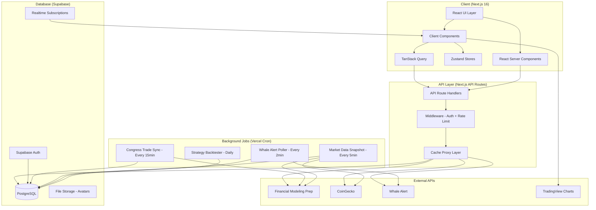

# Capitol Alpha — Full Implementation Plan
## Competitive Product for Stocks + Crypto Insider Intelligence

> **Product Name (Working):** Capitol Alpha
> **Tagline:** "Track the moves that move markets — Congress trades, whale wallets, and smart money."
> **Inspiration:** [Wolf of Washington](https://wolfofwashington.app/) — but expanded to cover **both stocks AND crypto**.

---

## 1. Executive Summary

### 1.1 What We're Building
A premium financial intelligence web application that combines:
1. **Congressional Trade Tracking** — Real-time alerts when US politicians buy/sell stocks (core Wolf of Washington feature)
2. **Crypto Whale Tracking** — Real-time alerts when major crypto wallets make significant moves
3. **Unified Dashboard** — A single command center covering both traditional stocks and crypto markets
4. **Copy-Trade Strategies** — Backtested strategies with win-rate analytics for both asset classes
5. **Market Visualization** — Interactive heatmaps for S&P 500 AND top crypto markets

### 1.2 Competitive Differentiators vs Wolf of Washington

| Feature | Wolf of Washington | Capitol Alpha (Ours) |
|---|---|---|
| Congressional stock trades | ✅ | ✅ |
| Crypto whale tracking | ❌ | ✅ |
| Crypto market heatmap | ❌ | ✅ |
| Stock market heatmap | ✅ | ✅ |
| Unified stock + crypto portfolio | ❌ | ✅ |
| Copy-trade strategies (stocks) | ✅ | ✅ |
| Copy-trade strategies (crypto) | ❌ | ✅ |
| AI-powered insights | Basic | ✅ Advanced |
| Community features | Locked/Coming | ✅ Day 1 |
| Mobile responsive | Partial | ✅ Full |

---

## 2. Template Decision

### 2.1 Comparison Matrix

| Criteria | next-shadcn-admin-dashboard | tanstack-start-dashboard |
|---|---|---|
| **Framework** | Next.js 16 (App Router) | TanStack Start |
| **Maturity** | High — multiple dashboards, auth, RBAC | Low — starter template |
| **Pre-built Screens** | Default, CRM, **Finance Dashboard**, Auth (4 screens) | Overview, Products, Settings only |
| **State Management** | Zustand (production-ready) | TanStack Query only |
| **Auth** | Built-in auth flows + RBAC | Placeholder only |
| **Theme System** | Multiple presets (Tangerine, Brutalist, etc.) | Basic dark/light |
| **Architecture** | Colocation-based (scalable) | Feature-based (good) |
| **Data Tables** | TanStack Table ✅ | TanStack Table ✅ |
| **Charts** | ✅ Built-in | Recharts ✅ |
| **Community/Stars** | Higher adoption | Lower adoption |
| **Tailwind Version** | v4 ✅ | v4 ✅ |
| **TypeScript** | ✅ | ✅ |

### 2.2 Decision: `next-shadcn-admin-dashboard`

**Rationale:**
1. **Finance Dashboard pre-built** — Direct head start for our stock/crypto dashboard
2. **Auth + RBAC ready** — Saves 2-3 weeks of auth development
3. **Next.js 16** — SSR/SSG for SEO, API routes for backend proxying, React Server Components for performance
4. **Colocation architecture** — Maps perfectly to our feature modules (Stocks, Crypto, Alerts, etc.)
5. **Zustand** — Superior state management for complex real-time data flows
6. **Multiple theme presets** — We can create a custom "Dark & Gold" premium theme inspired by Wolf of Washington's aesthetic
7. **Higher community adoption** — Better long-term support and contributions

---

## 3. Data Source Architecture

### 3.1 API Provider Selection

```
┌─────────────────────────────────────────────────────────────────┐
│                     DATA SOURCE LAYER                           │
├─────────────────┬──────────────────┬────────────────────────────┤
│  CONGRESS DATA  │   STOCK DATA     │      CRYPTO DATA           │
│                 │                  │                            │
│  Financial      │  Financial       │  CoinGecko API             │
│  Modeling Prep  │  Modeling Prep   │  (Free: 30 calls/min)      │
│  (FMP)          │  (FMP)           │                            │
│                 │                  │  Whale Alert API            │
│  Senate API     │  Real-time       │  (Free: basic alerts)      │
│  House API      │  Quotes API      │                            │
│  Insider API    │  Historical API  │  CoinMarketCap API         │
│                 │  Company Profile │  (Free: 10K credits/mo)    │
│  Free: 250/day  │  Sector Perf.    │                            │
│                 │  Market Movers   │                            │
├─────────────────┴──────────────────┴────────────────────────────┤
│              VISUALIZATION LAYER                                │
│                                                                 │
│  TradingView Lightweight Charts (Free, Apache 2.0)              │
│  - Stock price charts                                           │
│  - Crypto price charts                                          │
│  - Heatmap visualization plugin                                 │
│  - Candlestick / Area / Line series                             │
│                                                                 │
│  Recharts (already in template)                                 │
│  - Strategy performance charts                                  │
│  - Win-rate analytics                                           │
│  - Portfolio distribution pie charts                            │
└─────────────────────────────────────────────────────────────────┘
```

### 3.2 API Details

#### A. Financial Modeling Prep (FMP) — Primary Data Provider
- **Role:** Congress trades, stock quotes, company profiles, market movers
- **Free Tier:** 250 API calls/day, 5 years historical data, 500MB bandwidth/30 days
- **Key Endpoints:**
  - `GET /api/v4/senate-trading` — Senate financial disclosures
  - `GET /api/v4/senate-trading-rss-feed` — Real-time Senate trade feed
  - `GET /api/v4/house-disclosure` — House trading disclosures
  - `GET /api/v4/house-disclosure-rss-feed` — Real-time House trade feed
  - `GET /api/v3/quote/{symbol}` — Real-time stock quotes
  - `GET /api/v3/stock/actives` — Most active stocks
  - `GET /api/v3/stock/gainers` — Top gainers
  - `GET /api/v3/stock/losers` — Top losers
  - `GET /api/v3/sector-performance` — Sector heatmap data
  - `GET /api/v3/profile/{symbol}` — Company profile + logo
  - `GET /api/v3/historical-price-full/{symbol}` — Historical prices
- **Upgrade Path:** Starter plan ($14/mo) → 300 calls/min, real-time data

#### B. CoinGecko API — Crypto Market Data
- **Role:** Crypto prices, market data, trending coins, exchange data
- **Free Tier (Demo):** 30 calls/min, 10,000 calls/month
- **Key Endpoints:**
  - `GET /api/v3/coins/markets` — Market data for all coins (price, volume, market cap)
  - `GET /api/v3/coins/{id}` — Detailed coin data
  - `GET /api/v3/coins/{id}/market_chart` — Historical price data
  - `GET /api/v3/search/trending` — Trending coins
  - `GET /api/v3/global` — Global crypto market stats
  - `GET /api/v3/coins/categories` — Category-based market data (DeFi, L2, etc.)
  - `GET /api/v3/exchanges` — Exchange volumes
- **Upgrade Path:** Analyst plan ($14/mo) → 500 calls/min

#### C. Whale Alert API — Crypto Whale Tracking
- **Role:** Large crypto transaction alerts (our key differentiator)
- **Free Tier:** 10 requests/min, alerts ≥ $500K
- **Key Endpoints:**
  - `GET /api/v1/transactions` — Recent whale transactions
  - `GET /api/v1/transaction/{hash}` — Transaction details
  - `GET /api/v1/status` — API status
- **Data Fields:** blockchain, symbol, amount, amount_usd, from (owner_type), to (owner_type), timestamp
- **Owner Types:** unknown, exchange, whale, fund, government — perfect for filtering
- **Upgrade Path:** Personal plan ($9.99/mo) → unlimited alerts, historical data

#### D. TradingView Lightweight Charts — Visualization
- **Role:** Interactive financial charts and heatmaps
- **License:** Apache 2.0 (completely free, including commercial use)
- **Capabilities:**
  - Candlestick, Line, Area, Bar, Histogram series
  - Custom heatmap series plugin for market visualization
  - Real-time data updates via `update()` method
  - Responsive and touch-friendly
  - Dark theme support built-in
- **React Integration:** `lightweight-charts` npm package + React wrapper component

### 3.3 Data Caching & Rate Limit Strategy

```
┌──────────────────────────────────────────────────────┐
│                  CACHING LAYER                       │
├──────────────────────────────────────────────────────┤
│                                                      │
│  Next.js API Routes (Backend Proxy)                  │
│  ├── /api/congress/trades     → Cache: 15 min        │
│  ├── /api/congress/alerts     → Cache: 5 min         │
│  ├── /api/stocks/quotes       → Cache: 1 min         │
│  ├── /api/stocks/heatmap      → Cache: 5 min         │
│  ├── /api/crypto/prices       → Cache: 1 min         │
│  ├── /api/crypto/whales       → Cache: 2 min         │
│  └── /api/crypto/heatmap      → Cache: 5 min         │
│                                                      │
│  TanStack Query (Client-Side)                        │
│  ├── staleTime: matches server cache                 │
│  ├── refetchOnWindowFocus: true                      │
│  └── Background refetch intervals per query          │
│                                                      │
│  Zustand (Client State)                              │
│  ├── User preferences                                │
│  ├── Watchlist / Portfolio                            │
│  ├── Theme settings                                  │
│  └── Alert notification queue                        │
│                                                      │
│  Database (Supabase / PostgreSQL)                    │
│  ├── User accounts & auth                            │
│  ├── Cached congress trade history (daily sync)      │
│  ├── User portfolios & positions                     │
│  ├── User watchlists                                 │
│  ├── Alert preferences                               │
│  └── Community posts                                 │
│                                                      │
└──────────────────────────────────────────────────────┘
```

---

## 4. System Architecture

### 4.1 High-Level Architecture Diagram



### 4.2 Database Schema (Supabase PostgreSQL)

```sql
-- ============================================================
-- CORE USER TABLES
-- ============================================================

CREATE TABLE users (
    id UUID PRIMARY KEY DEFAULT gen_random_uuid(),
    email TEXT UNIQUE NOT NULL,
    display_name TEXT,
    avatar_url TEXT,
    subscription_tier TEXT DEFAULT 'free', -- free | pro | premium
    created_at TIMESTAMPTZ DEFAULT NOW(),
    updated_at TIMESTAMPTZ DEFAULT NOW()
);

CREATE TABLE user_preferences (
    user_id UUID PRIMARY KEY REFERENCES users(id),
    theme TEXT DEFAULT 'dark',
    default_market TEXT DEFAULT 'stocks', -- stocks | crypto | both
    alert_email BOOLEAN DEFAULT true,
    alert_push BOOLEAN DEFAULT true,
    alert_min_amount NUMERIC DEFAULT 50000,
    watchlist_ids TEXT[] DEFAULT '{}'
);

-- ============================================================
-- CONGRESS TRADE TABLES (Synced from FMP)
-- ============================================================

CREATE TABLE politicians (
    id UUID PRIMARY KEY DEFAULT gen_random_uuid(),
    fmp_id TEXT UNIQUE,
    name TEXT NOT NULL,
    party TEXT, -- Democrat | Republican | Independent
    chamber TEXT, -- Senate | House
    state TEXT,
    district TEXT,
    committees TEXT[],
    avatar_url TEXT,
    total_trades INTEGER DEFAULT 0,
    win_rate NUMERIC DEFAULT 0,
    favorite_sector TEXT,
    last_trade_date DATE,
    created_at TIMESTAMPTZ DEFAULT NOW(),
    updated_at TIMESTAMPTZ DEFAULT NOW()
);

CREATE TABLE congress_trades (
    id UUID PRIMARY KEY DEFAULT gen_random_uuid(),
    politician_id UUID REFERENCES politicians(id),
    ticker TEXT NOT NULL,
    company_name TEXT,
    transaction_type TEXT NOT NULL, -- Purchase | Sale | Exchange
    amount_range TEXT, -- $1,001 - $15,000 | $15,001 - $50,000 | etc.
    amount_numeric NUMERIC, -- Estimated midpoint for analytics
    transaction_date DATE NOT NULL,
    disclosure_date DATE NOT NULL,
    days_lag INTEGER,
    sector TEXT,
    asset_type TEXT DEFAULT 'stock', -- stock
    price_at_trade NUMERIC,
    price_at_disclosure NUMERIC,
    pnl_percent NUMERIC, -- Calculated P/L from trade to disclosure
    source_url TEXT,
    created_at TIMESTAMPTZ DEFAULT NOW()
);

CREATE INDEX idx_congress_trades_ticker ON congress_trades(ticker);
CREATE INDEX idx_congress_trades_politician ON congress_trades(politician_id);
CREATE INDEX idx_congress_trades_date ON congress_trades(transaction_date DESC);
CREATE INDEX idx_congress_trades_sector ON congress_trades(sector);

-- ============================================================
-- CRYPTO WHALE TABLES (Synced from Whale Alert)
-- ============================================================

CREATE TABLE whale_transactions (
    id UUID PRIMARY KEY DEFAULT gen_random_uuid(),
    blockchain TEXT NOT NULL,
    tx_hash TEXT UNIQUE NOT NULL,
    symbol TEXT NOT NULL,
    amount NUMERIC NOT NULL,
    amount_usd NUMERIC NOT NULL,
    from_address TEXT,
    from_owner TEXT, -- exchange name or 'unknown'
    from_owner_type TEXT, -- unknown | exchange | whale | fund
    to_address TEXT,
    to_owner TEXT,
    to_owner_type TEXT,
    timestamp TIMESTAMPTZ NOT NULL,
    created_at TIMESTAMPTZ DEFAULT NOW()
);

CREATE INDEX idx_whale_tx_symbol ON whale_transactions(symbol);
CREATE INDEX idx_whale_tx_timestamp ON whale_transactions(timestamp DESC);
CREATE INDEX idx_whale_tx_amount ON whale_transactions(amount_usd DESC);

-- ============================================================
-- ALERTS TABLE (Unified for both stocks and crypto)
-- ============================================================

CREATE TABLE alerts (
    id UUID PRIMARY KEY DEFAULT gen_random_uuid(),
    alert_type TEXT NOT NULL, -- congress_trade | whale_move | price_alert | strategy_signal
    market TEXT NOT NULL, -- stocks | crypto
    severity TEXT DEFAULT 'medium', -- low | medium | high | critical
    title TEXT NOT NULL,
    message TEXT NOT NULL,
    ticker TEXT,
    amount_usd NUMERIC,
    metadata JSONB DEFAULT '{}',
    -- links to source
    congress_trade_id UUID REFERENCES congress_trades(id),
    whale_transaction_id UUID REFERENCES whale_transactions(id),
    created_at TIMESTAMPTZ DEFAULT NOW()
);

CREATE INDEX idx_alerts_type ON alerts(alert_type);
CREATE INDEX idx_alerts_market ON alerts(market);
CREATE INDEX idx_alerts_created ON alerts(created_at DESC);

-- ============================================================
-- USER PORTFOLIO TABLES
-- ============================================================

CREATE TABLE portfolio_positions (
    id UUID PRIMARY KEY DEFAULT gen_random_uuid(),
    user_id UUID REFERENCES users(id) NOT NULL,
    ticker TEXT NOT NULL,
    asset_type TEXT NOT NULL, -- stock | crypto
    position_type TEXT NOT NULL, -- long | short
    entry_price NUMERIC NOT NULL,
    quantity NUMERIC NOT NULL,
    entry_date DATE NOT NULL,
    exit_price NUMERIC,
    exit_date DATE,
    status TEXT DEFAULT 'open', -- open | closed
    notes TEXT,
    created_at TIMESTAMPTZ DEFAULT NOW(),
    updated_at TIMESTAMPTZ DEFAULT NOW()
);

CREATE TABLE watchlist_items (
    id UUID PRIMARY KEY DEFAULT gen_random_uuid(),
    user_id UUID REFERENCES users(id) NOT NULL,
    ticker TEXT NOT NULL,
    asset_type TEXT NOT NULL, -- stock | crypto
    added_at TIMESTAMPTZ DEFAULT NOW(),
    UNIQUE(user_id, ticker, asset_type)
);

-- ============================================================
-- STRATEGY / BACKTESTING TABLES
-- ============================================================

CREATE TABLE strategies (
    id UUID PRIMARY KEY DEFAULT gen_random_uuid(),
    name TEXT NOT NULL,
    market TEXT NOT NULL, -- stocks | crypto | both
    description TEXT,
    methodology TEXT, -- congress_follow | whale_follow | combined
    holding_period TEXT, -- 30d | 90d | 180d | 365d
    backtest_start_date DATE,
    backtest_end_date DATE,
    total_trades INTEGER,
    win_rate NUMERIC,
    annualized_return NUMERIC,
    max_drawdown NUMERIC,
    sharpe_ratio NUMERIC,
    benchmark TEXT, -- SP500 | BTC | ETH
    benchmark_return NUMERIC,
    is_active BOOLEAN DEFAULT true,
    updated_at TIMESTAMPTZ DEFAULT NOW()
);

CREATE TABLE strategy_positions (
    id UUID PRIMARY KEY DEFAULT gen_random_uuid(),
    strategy_id UUID REFERENCES strategies(id),
    ticker TEXT NOT NULL,
    entry_date DATE NOT NULL,
    entry_price NUMERIC NOT NULL,
    exit_date DATE,
    exit_price NUMERIC,
    pnl_percent NUMERIC,
    status TEXT DEFAULT 'open', -- open | closed
    source_alert_id UUID REFERENCES alerts(id)
);

-- ============================================================
-- COMMUNITY TABLES
-- ============================================================

CREATE TABLE community_posts (
    id UUID PRIMARY KEY DEFAULT gen_random_uuid(),
    user_id UUID REFERENCES users(id) NOT NULL,
    title TEXT,
    content TEXT NOT NULL,
    post_type TEXT DEFAULT 'discussion', -- discussion | analysis | trade_idea | question
    market TEXT, -- stocks | crypto | both
    ticker TEXT,
    likes_count INTEGER DEFAULT 0,
    comments_count INTEGER DEFAULT 0,
    created_at TIMESTAMPTZ DEFAULT NOW(),
    updated_at TIMESTAMPTZ DEFAULT NOW()
);

CREATE TABLE community_comments (
    id UUID PRIMARY KEY DEFAULT gen_random_uuid(),
    post_id UUID REFERENCES community_posts(id) NOT NULL,
    user_id UUID REFERENCES users(id) NOT NULL,
    content TEXT NOT NULL,
    likes_count INTEGER DEFAULT 0,
    created_at TIMESTAMPTZ DEFAULT NOW()
);
```

### 4.3 Colocation-Based File Structure

```
src/
├── app/
│   ├── (auth)/                           # Auth route group
│   │   ├── login/
│   │   │   ├── page.tsx                  # Login page
│   │   │   └── _components/
│   │   │       └── login-form.tsx
│   │   ├── signup/
│   │   │   ├── page.tsx
│   │   │   └── _components/
│   │   │       └── signup-form.tsx
│   │   └── layout.tsx                    # Auth layout (centered card)
│   │
│   ├── (dashboard)/                      # Dashboard route group
│   │   ├── layout.tsx                    # Sidebar + Header layout
│   │   ├── dashboard/
│   │   │   ├── page.tsx                  # Main dashboard (RSC)
│   │   │   └── _components/
│   │   │       ├── portfolio-summary.tsx  # KPI cards
│   │   │       ├── insider-tip.tsx        # Rotating insider tip banner
│   │   │       ├── latest-alert-card.tsx  # Featured trade alert
│   │   │       ├── recent-trades.tsx      # Recent congress/whale trades feed
│   │   │       ├── premarket-briefing.tsx  # Market intelligence accordion
│   │   │       ├── stock-heatmap.tsx      # TradingView S&P 500 heatmap
│   │   │       ├── crypto-heatmap.tsx     # CoinGecko crypto market heatmap
│   │   │       └── quick-actions.tsx      # Navigation shortcuts
│   │   │
│   │   ├── research/
│   │   │   ├── page.tsx                  # Research timeline
│   │   │   └── _components/
│   │   │       ├── timeline-feed.tsx
│   │   │       ├── analysis-card.tsx
│   │   │       └── market-insight.tsx
│   │   │
│   │   ├── strategy/
│   │   │   ├── overview/
│   │   │   │   ├── page.tsx              # Strategy performance overview
│   │   │   │   └── _components/
│   │   │   │       ├── win-rate-chart.tsx
│   │   │   │       ├── holding-period-analysis.tsx
│   │   │   │       ├── strategy-positions-table.tsx
│   │   │   │       └── benchmark-comparison.tsx
│   │   │   └── backtester/
│   │   │       ├── page.tsx              # Strategy backtesting tool
│   │   │       └── _components/
│   │   │           └── backtest-config.tsx
│   │   │
│   │   ├── data-explorer/
│   │   │   ├── trades/
│   │   │   │   ├── page.tsx              # Trades table (43k+ rows)
│   │   │   │   └── _components/
│   │   │   │       ├── trades-table.tsx
│   │   │   │       └── trade-filters.tsx
│   │   │   ├── politicians/
│   │   │   │   ├── page.tsx              # Politician directory
│   │   │   │   ├── [id]/
│   │   │   │   │   └── page.tsx          # Individual politician profile
│   │   │   │   └── _components/
│   │   │   │       ├── politician-grid.tsx
│   │   │   │       └── politician-card.tsx
│   │   │   └── whales/
│   │   │       ├── page.tsx              # Whale directory (NEW)
│   │   │       └── _components/
│   │   │           ├── whale-table.tsx
│   │   │           └── whale-filters.tsx
│   │   │
│   │   ├── community/
│   │   │   ├── page.tsx                  # Community hub
│   │   │   └── _components/
│   │   │       ├── post-feed.tsx
│   │   │       ├── create-post.tsx
│   │   │       └── post-card.tsx
│   │   │
│   │   ├── portfolio/
│   │   │   ├── page.tsx                  # Portfolio manager
│   │   │   └── _components/
│   │   │       ├── positions-table.tsx
│   │   │       ├── portfolio-analytics.tsx
│   │   │       ├── watchlist.tsx
│   │   │       └── add-position-modal.tsx
│   │   │
│   │   ├── alerts/
│   │   │   ├── page.tsx                  # Alert feed
│   │   │   └── _components/
│   │   │       ├── alert-feed.tsx
│   │   │       ├── alert-card.tsx
│   │   │       └── alert-filters.tsx
│   │   │
│   │   └── settings/
│   │       ├── page.tsx                  # Settings panel
│   │       └── _components/
│   │           ├── account-settings.tsx
│   │           ├── notification-settings.tsx
│   │           └── subscription-settings.tsx
│   │
│   ├── api/                              # Next.js API routes (backend proxy)
│   │   ├── congress/
│   │   │   ├── trades/route.ts           # GET congress trades (cached)
│   │   │   ├── alerts/route.ts           # GET congress alerts
│   │   │   └── politicians/route.ts      # GET politician profiles
│   │   ├── stocks/
│   │   │   ├── quotes/route.ts           # GET real-time stock quotes
│   │   │   ├── heatmap/route.ts          # GET sector performance data
│   │   │   ├── movers/route.ts           # GET top movers
│   │   │   └── historical/route.ts       # GET historical price data
│   │   ├── crypto/
│   │   │   ├── prices/route.ts           # GET crypto prices (CoinGecko)
│   │   │   ├── whales/route.ts           # GET whale transactions
│   │   │   ├── heatmap/route.ts          # GET crypto market data
│   │   │   └── trending/route.ts         # GET trending coins
│   │   ├── portfolio/
│   │   │   ├── positions/route.ts
│   │   │   └── watchlist/route.ts
│   │   ├── alerts/route.ts
│   │   ├── community/route.ts
│   │   └── cron/                         # Vercel Cron jobs
│   │       ├── sync-congress/route.ts    # Sync FMP congress data → DB
│   │       ├── sync-whales/route.ts      # Poll Whale Alert → DB
│   │       └── backtest/route.ts         # Run daily backtest
│   │
│   ├── layout.tsx                        # Root layout
│   ├── page.tsx                          # Landing page
│   └── globals.css                       # Global styles + Dark & Gold theme
│
├── components/
│   ├── ui/                               # Shadcn UI components
│   ├── charts/
│   │   ├── tradingview-chart.tsx          # TradingView Lightweight wrapper
│   │   ├── stock-heatmap.tsx             # Stock market treemap
│   │   ├── crypto-heatmap.tsx            # Crypto market treemap
│   │   └── performance-chart.tsx         # Recharts performance line
│   ├── layout/
│   │   ├── app-sidebar.tsx               # Main sidebar navigation
│   │   ├── header.tsx                    # Top header + search
│   │   ├── market-toggle.tsx             # Stocks/Crypto/Both toggle
│   │   └── theme-toggle.tsx
│   └── shared/
│       ├── ticker-badge.tsx
│       ├── party-badge.tsx
│       ├── severity-badge.tsx
│       ├── amount-badge.tsx
│       ├── pnl-indicator.tsx
│       └── loading-skeleton.tsx
│
├── lib/
│   ├── api/
│   │   ├── fmp.ts                        # FMP API client
│   │   ├── coingecko.ts                  # CoinGecko API client
│   │   ├── whale-alert.ts               # Whale Alert API client
│   │   └── types.ts                      # Shared API types
│   ├── supabase/
│   │   ├── client.ts                     # Browser Supabase client
│   │   ├── server.ts                     # Server Supabase client
│   │   └── types.ts                      # Database types (generated)
│   ├── utils/
│   │   ├── format-currency.ts
│   │   ├── format-date.ts
│   │   ├── calculate-pnl.ts
│   │   └── constants.ts
│   └── validations/
│       ├── auth.ts                       # Zod schemas for auth
│       ├── portfolio.ts                  # Zod schemas for portfolio
│       └── alert.ts                      # Zod schemas for alerts
│
├── stores/
│   ├── market-store.ts                   # Active market (stocks/crypto/both)
│   ├── portfolio-store.ts                # Portfolio state
│   ├── alert-store.ts                    # Real-time alert queue
│   └── theme-store.ts                    # Theme preferences
│
├── hooks/
│   ├── use-congress-trades.ts            # TanStack Query hook
│   ├── use-whale-transactions.ts         # TanStack Query hook
│   ├── use-stock-quotes.ts              # TanStack Query hook
│   ├── use-crypto-prices.ts             # TanStack Query hook
│   ├── use-portfolio.ts                  # Portfolio CRUD
│   ├── use-alerts.ts                     # Alert feed hook
│   └── use-market-toggle.ts             # Market context toggle
│
└── types/
    ├── congress.ts                       # Congress trade types
    ├── crypto.ts                         # Crypto market types
    ├── portfolio.ts                      # Portfolio types
    ├── alert.ts                          # Alert types
    └── strategy.ts                       # Strategy types
```

---

## 5. Design System

### 5.1 Theme: "Midnight Gold" (Inspired by Wolf of Washington)

```css
/* Capitol Alpha — Dark & Gold Premium Theme */
:root {
  /* Background hierarchy */
  --bg-primary:    #000000;      /* True black base */
  --bg-secondary:  #0A0A0A;      /* Card backgrounds */
  --bg-tertiary:   #121212;      /* Elevated surfaces */
  --bg-elevated:   #1A1A1A;      /* Hover states / modals */

  /* Accent: Gold */
  --accent-gold:        #FFD700;  /* Primary CTA, active nav */
  --accent-gold-hover:  #FFC300;  /* Hover state */
  --accent-gold-muted:  #B8860B;  /* Subtle gold accents */
  --accent-gold-bg:     rgba(255, 215, 0, 0.08); /* Gold tint background */

  /* Signal Colors */
  --signal-buy:    #22C55E;       /* Green — purchase indicators */
  --signal-sell:   #EF4444;       /* Red — sale indicators */
  --signal-hold:   #F59E0B;       /* Amber — hold/neutral */
  --signal-whale:  #8B5CF6;       /* Purple — whale activity */
  --signal-alert:  #3B82F6;       /* Blue — informational */

  /* Text hierarchy */
  --text-primary:   #FFFFFF;
  --text-secondary: #A0A0A0;
  --text-muted:     #666666;

  /* Borders */
  --border-default: #1E1E1E;
  --border-hover:   #333333;
  --border-gold:    rgba(255, 215, 0, 0.3);

  /* Typography */
  --font-sans: 'Inter', system-ui, sans-serif;
  --font-mono: 'JetBrains Mono', monospace;
}
```

### 5.2 Sidebar Navigation (Modified from Wolf of Washington)

```
Sidebar Items:
├── 📊 Dashboard           (/) — Command center
├── 📰 Research Desk       (/research) — Timeline feed
├── 🎯 Strategy            (collapsible)
│   ├── Overview           (/strategy/overview)
│   └── Backtester         (/strategy/backtester)
├── 🔍 Data Explorer       (collapsible)
│   ├── Congress Trades    (/data-explorer/trades)
│   ├── Politicians        (/data-explorer/politicians)
│   └── Whale Tracker      (/data-explorer/whales)       ← NEW
├── 💬 Community           (/community)
├── 💼 Portfolio           (/portfolio)
├── 🔔 Alerts              (/alerts)
└── ⚙️ Settings            (/settings)
```

### 5.3 Dashboard Layout (Unified Stocks + Crypto)

```
┌─────────────────────────────────────────────────────────────────┐
│ [Sidebar]    Welcome back, {User}                               │
│              Track insider moves and whale activity              │
│                                                                 │
│              ┌──────────┐ Market Toggle: [Stocks] [Crypto] [All]│
├──────────────┤                                                   │
│              │ ┌──────┐ ┌──────┐ ┌──────┐ ┌──────┐             │
│              │ │Port. │ │P/L   │ │Top   │ │Activity│            │
│              │ │Value │ │Today │ │Mover │ │24h    │             │
│              │ └──────┘ └──────┘ └──────┘ └──────┘             │
│              │                                                   │
│              │ ┌─── LATEST ALERT ────────────────────┐          │
│              │ │ [Politician Photo / Whale Icon]      │          │
│              │ │ Title + Summary + Impact Badge       │          │
│              │ └─────────────────────────────────────┘          │
│              │                                                   │
│              │ ┌─── Recent Trades ────┐ ┌─ Briefing ──┐        │
│              │ │ NVDA BUY  $250K 5d   │ │ Markets     │        │
│              │ │ BTC  WHALE $50M 2h   │ │ Policy      │        │
│              │ │ ETH  WHALE $20M 4h   │ │ Top Mover   │        │
│              │ └──────────────────────┘ └─────────────┘        │
│              │                                                   │
│              │ ┌─── Market Heatmap ──────────────────┐          │
│              │ │ [Tab: S&P 500 | Crypto Top 100]     │          │
│              │ │ ┌─────────────────────────────────┐ │          │
│              │ │ │ Interactive Treemap              │ │          │
│              │ │ │ (TradingView / Custom D3)        │ │          │
│              │ │ └─────────────────────────────────┘ │          │
│              │ └─────────────────────────────────────┘          │
│              │                                                   │
│              │ ┌─── Quick Actions ───────────────────┐          │
│              │ │ View Trades | Politicians | Whales   │          │
│              │ │ My Portfolio | Latest News | AI      │          │
│              │ └─────────────────────────────────────┘          │
│              │                                                   │
└──────────────┴───────────────────────────────────────────────────┘
```

---

## 6. Feature Specifications

### 6.1 Feature: Market Toggle (Global)
- **Purpose:** Toggle between Stocks view, Crypto view, or unified All view
- **Behavior:** Persisted in Zustand store + localStorage. Affects ALL pages.
- **UI:** Segmented control in the header: `[Stocks] [Crypto] [All]`
- **Effect on Dashboard:** Shows stock heatmap OR crypto heatmap OR both
- **Effect on Alerts:** Filters alerts by market type
- **Effect on Data Explorer:** Shows congress trades OR whale transactions OR both

### 6.2 Feature: Congress Trade Alert System
- **Data Flow:** FMP API → Cron Job (every 15 min) → PostgreSQL → Supabase Realtime → Client
- **Alert Severity Calculation:**
  - `CRITICAL`: Amount > $1M OR politician is committee chair
  - `HIGH`: Amount > $250K
  - `MEDIUM`: Amount > $50K
  - `LOW`: Amount < $50K
- **Alert Card Fields:** Politician name, party badge, ticker, company, amount, type (BUY/SELL), sector, days lag

### 6.3 Feature: Crypto Whale Alert System (NEW Differentiator)
- **Data Flow:** Whale Alert API → Cron Job (every 2 min) → PostgreSQL → Supabase Realtime → Client
- **Alert Severity Calculation:**
  - `CRITICAL`: Amount > $50M OR exchange → unknown wallet (accumulation)
  - `HIGH`: Amount > $10M
  - `MEDIUM`: Amount > $1M
  - `LOW`: Amount > $500K
- **Alert Card Fields:** Blockchain, symbol, amount (USD), from (type), to (type), transaction hash link
- **Special Indicators:**
  - 🏦→🔒 Exchange to Unknown Wallet = "Accumulation Signal"
  - 🔒→🏦 Unknown Wallet to Exchange = "Potential Sell Signal"
  - 🏦→🏦 Exchange to Exchange = "Neutral Transfer"

### 6.4 Feature: Strategy Dashboard
- **Congress Follow Strategy (Stocks):**
  - Buy when politician buys, hold for 30/90/180/365 days
  - Show win rate, annualized return, max drawdown
  - Benchmark against S&P 500
- **Whale Follow Strategy (Crypto) — NEW:**
  - Buy when whale accumulates (exchange → wallet), hold for 7/30/90 days
  - Show win rate, annualized return, max drawdown
  - Benchmark against BTC and ETH
- **Combined Strategy — NEW:**
  - 60% congress follow (stocks) + 40% whale follow (crypto)
  - Rebalanced monthly

### 6.5 Feature: Data Explorer
- **Congress Trades Tab:** (Existing pattern from Wolf of Washington)
  - TanStack Table with server-side pagination (43k+ rows)
  - Filters: Politician, Party, Sector, Date Range, Amount, Type
  - Search: Ticker, Company Name, Politician Name
- **Politicians Directory:** Card grid with infinite scroll
- **Whale Tracker Tab (NEW):**
  - TanStack Table with real-time updates
  - Filters: Blockchain, Symbol, Amount Range, Owner Type, Date Range
  - Live indicator for recent transactions

### 6.6 Feature: Portfolio Manager
- **Unified Portfolio:** Track both stock and crypto positions in one view
- **Tabs:** Positions, Analytics, Watchlist
- **Position Entry:** Manual entry with ticker, entry price, quantity, date
- **Auto-Pricing:** Live price updates from FMP (stocks) or CoinGecko (crypto)
- **P&L Calculation:** Real-time unrealized P/L with position-level and portfolio-level views

### 6.7 Feature: Community Hub
- **Post Types:** Discussion, Analysis, Trade Idea, Question
- **Market Tags:** Stocks, Crypto, Both
- **Engagement:** Likes, Comments, Shares
- **Moderation:** Basic content moderation via Supabase RLS policies

---

## 7. Implementation Phases

### Phase 1: Foundation (Weeks 1-2)
- [ ] Clone and customize `next-shadcn-admin-dashboard` template
- [ ] Set up "Midnight Gold" theme (dark + gold accent)
- [ ] Configure Supabase project (auth, database, realtime)
- [ ] Set up API client libraries (FMP, CoinGecko, Whale Alert)
- [ ] Create database schema and migrations
- [ ] Implement auth flows (login, signup, forgot password)
- [ ] Set up sidebar navigation structure

### Phase 2: Core Data Pipeline (Weeks 3-4)
- [ ] Build API route handlers with caching layer
- [ ] Implement congress trade sync cron job
- [ ] Implement whale alert polling cron job
- [ ] Build TanStack Query hooks for all data sources
- [ ] Set up Supabase Realtime subscriptions for alerts
- [ ] Test data flow end-to-end

### Phase 3: Dashboard & Visualization (Weeks 5-6)
- [ ] Build dashboard page with all sub-components
- [ ] Integrate TradingView Lightweight Charts (stock heatmap)
- [ ] Build custom crypto heatmap component
- [ ] Implement market toggle (Stocks/Crypto/All)
- [ ] Build portfolio summary cards
- [ ] Build recent trades feed (unified)
- [ ] Build premarket briefing accordion

### Phase 4: Data Explorer & Strategy (Weeks 7-8)
- [ ] Build congress trades table (server-side pagination)
- [ ] Build politician directory (infinite scroll grid)
- [ ] Build whale tracker table
- [ ] Build politician profile pages
- [ ] Build strategy overview page with performance charts
- [ ] Implement holding period analysis component
- [ ] Build benchmark comparison charts

### Phase 5: Portfolio, Alerts & Community (Weeks 9-10)
- [ ] Build portfolio manager with positions table
- [ ] Build portfolio analytics view
- [ ] Build watchlist management
- [ ] Build alert feed with infinite scroll
- [ ] Build alert filters and search
- [ ] Implement real-time alert notifications (toast + sound)
- [ ] Build community hub (posts, comments, likes)

### Phase 6: Polish & Launch (Weeks 11-12)
- [ ] Performance optimization (React Server Components, lazy loading)
- [ ] Mobile responsive pass
- [ ] SEO optimization (meta tags, OG images)
- [ ] Error handling and edge cases
- [ ] Loading states and skeletons
- [ ] Analytics integration (PostHog / Vercel Analytics)
- [ ] Deploy to Vercel + custom domain
- [ ] Landing page with product marketing

---

## 8. Tech Stack Summary

| Layer | Technology | Purpose |
|---|---|---|
| **Framework** | Next.js 16 (App Router) | SSR, SSG, API Routes, RSC |
| **Language** | TypeScript (strict) | Type safety |
| **UI Components** | Shadcn UI | Accessible, customizable |
| **Styling** | Tailwind CSS v4 | Utility-first CSS |
| **State** | Zustand | Client-side global state |
| **Data Fetching** | TanStack Query | Server state management |
| **Tables** | TanStack Table | Virtualized, sortable, filterable |
| **Forms** | React Hook Form + Zod | Form validation |
| **Charts** | TradingView Lightweight Charts | Financial charts + heatmaps |
| **Charts (Secondary)** | Recharts | Analytics charts |
| **Database** | Supabase (PostgreSQL) | Data storage + auth + realtime |
| **Auth** | Supabase Auth | Email/OAuth authentication |
| **Realtime** | Supabase Realtime | Live alert subscriptions |
| **Hosting** | Vercel | Serverless hosting + cron |
| **APIs** | FMP, CoinGecko, Whale Alert | External data sources |
| **Linting** | Biome | Fast linting + formatting |
| **Testing** | Vitest + Playwright | Unit + E2E testing |

---

## 9. Deployment Architecture

```
┌─────────────────────────────────────────────────┐
│                    Vercel                         │
│                                                   │
│  ┌─────────────┐  ┌──────────────────────────┐  │
│  │ Edge Network │  │ Serverless Functions      │  │
│  │ (CDN + SSR) │  │ (API Routes + Cron Jobs)  │  │
│  └─────────────┘  └──────────────────────────┘  │
│         │                    │                    │
│         └────────┬───────────┘                    │
│                  │                                │
│    ┌─────────────▼─────────────┐                  │
│    │ Environment Variables     │                  │
│    │ FMP_API_KEY               │                  │
│    │ COINGECKO_API_KEY         │                  │
│    │ WHALE_ALERT_API_KEY       │                  │
│    │ SUPABASE_URL              │                  │
│    │ SUPABASE_ANON_KEY         │                  │
│    │ SUPABASE_SERVICE_KEY      │                  │
│    └───────────────────────────┘                  │
└─────────────────────────────────────────────────┘
                    │
        ┌───────────▼───────────┐
        │      Supabase         │
        │  ┌─────────────────┐  │
        │  │   PostgreSQL    │  │
        │  │   Auth          │  │
        │  │   Realtime      │  │
        │  │   Storage       │  │
        │  └─────────────────┘  │
        └───────────────────────┘
```

---

## 10. Risk Mitigation

| Risk | Probability | Impact | Mitigation |
|---|---|---|---|
| FMP API rate limit hit | Medium | High | Server-side caching (15min), DB sync, upgrade to Starter plan |
| CoinGecko rate limit hit | Medium | Medium | Client-side caching, batch requests, upgrade to Analyst plan |
| Whale Alert free tier too limited | Low | Medium | Cache aggressively, upgrade to Personal ($9.99/mo) |
| Supabase free tier limits | Low | High | Monitor usage, upgrade to Pro ($25/mo) when needed |
| Data freshness for real-time | Medium | Medium | Clear staleness indicators in UI, configurable refresh |
| Template breaking changes | Low | Medium | Pin Next.js and dependency versions |
| Congress disclosure delays | High | Low | Show "disclosure lag" prominently in UI |

---

## 11. Cost Estimation (Monthly)

### Free Tier Operation
| Service | Cost | Limit |
|---|---|---|
| FMP API (Free) | $0 | 250 calls/day |
| CoinGecko (Demo) | $0 | 10K calls/month |
| Whale Alert (Free) | $0 | 10 req/min |
| Supabase (Free) | $0 | 500MB DB, 50K auth users |
| Vercel (Hobby) | $0 | 100 GB bandwidth |
| **Total** | **$0/mo** | |

### Production Tier (Post-Launch)
| Service | Cost | Limit |
|---|---|---|
| FMP API (Starter) | $14/mo | 300 calls/min |
| CoinGecko (Analyst) | $14/mo | 500 calls/min |
| Whale Alert (Personal) | $9.99/mo | Unlimited alerts |
| Supabase (Pro) | $25/mo | 8GB DB, unlimited auth |
| Vercel (Pro) | $20/mo | 1TB bandwidth |
| Custom domain | $12/yr | — |
| **Total** | **~$84/mo** | |

---

*This document is designed to be consumed by AI agents for implementation. All file paths, API endpoints, data schemas, and architecture decisions are explicitly defined for automated code generation.*
