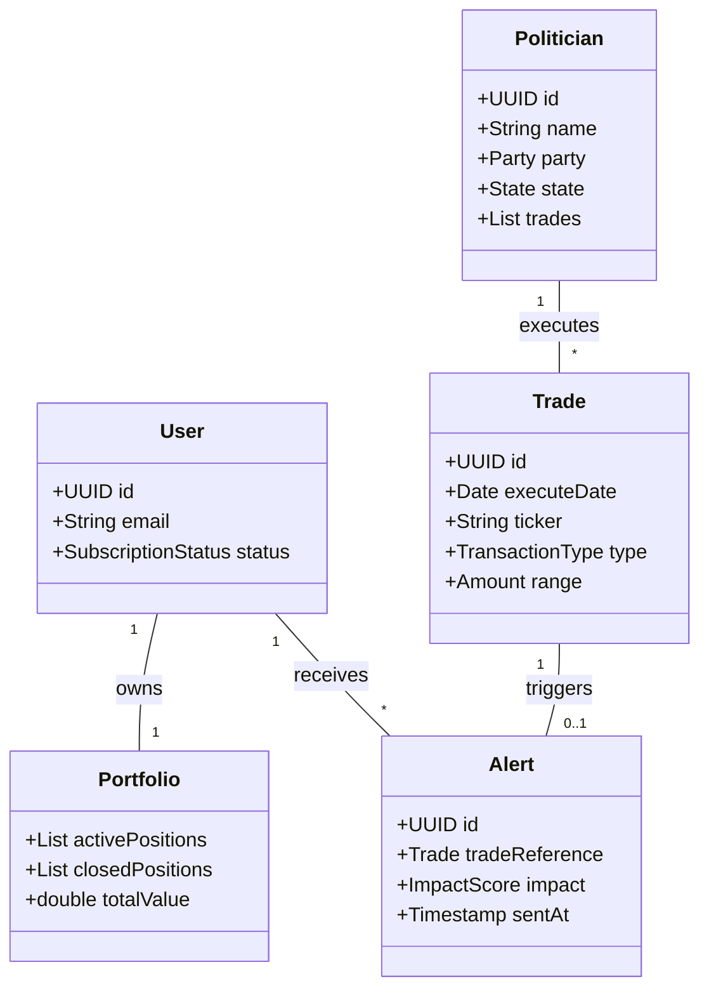
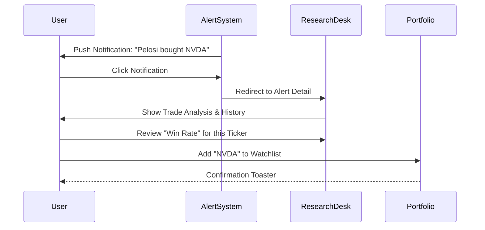
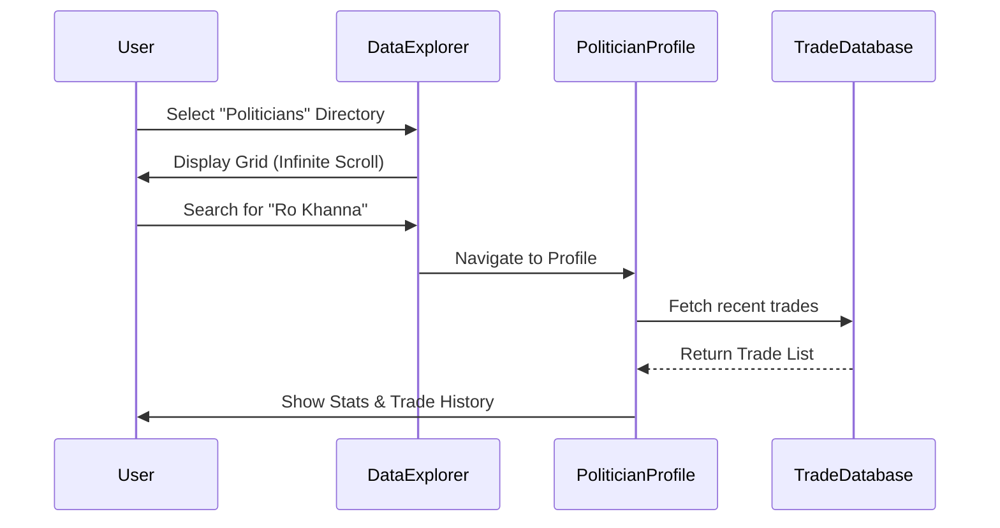

# Wolf of Washington - Application Analysis & Technical Specification

## 1. System Context & Architecture

### High-Level Domain Model
The following diagram illustrates the core relationships within the Wolf of Washington ecosystem.



## 2. Executive Summary
**Wolf of Washington** is a specialized financial intelligence platform designed to track and capitalize on the stock trading activities of US Congress members ("Insider Trading Alerts"). The application leverages a dark, high-contrast aesthetic to project exclusivity and professional-grade data analytics.

**Core Value Proposition:**
- **Real-time Alerts:** Notifications when politicians trade.
- **Copy-Trading Strategy:** Data-backed strategies showing high win rates (up to 77%) based on politician holding periods.
- **Transparency:** Full database of searchable congress trades.

---

## 3. Data Models (JSON Schemas)
These schemas define the core data structures used throughout the application. AI agents should use these definitions when generating API types or database schemas.

### A. Politician Profile
```json
{
  "id": "pol_12345",
  "name": "Nancy Pelosi",
  "party": "Democrat",
  "state": "CA",
  "chamber": "House",
  "committees": ["Speaker Emeritus"],
  "stats": {
    "totalTrades": 142,
    "winRate": 0.68,
    "favoriteSector": "Technology"
  }
}
```

### B. Trade Transaction
```json
{
  "id": "trd_98765",
  "politicianId": "pol_12345",
  "ticker": "NVDA",
  "companyName": "NVIDIA Corp",
  "type": "Purchase",
  "amount": "$1,000,001 - $5,000,000",
  "transactionDate": "2024-11-22",
  "disclosureDate": "2024-12-20",
  "daysLag": 28
}
```

### C. Alert Signal
```json
{
  "id": "alt_55555",
  "tradeId": "trd_98765",
  "severity": "HIGH",
  "message": "Nancy Pelosi disclosed a massive purchase of NVDA.",
  "timestamp": "2024-12-20T14:30:00Z",
  "category": "Technology"
}
```

---

## 4. User Workflows (Sequence Diagrams)

### Workflow: Signal Execution
How a user interacts with a new trade alert.



### Workflow: Researching a Politician
How a user investigates a specific figure.



---

## 5. Component Reference & UI Breakdown

### Global Design System
- **Theme:** Premium Dark Mode (`#000000` / `#121212` backgrounds).
- **Accent:** Gold/Yellow (`#FFD700`).
- **Typography:** Sans-Serif (Inter/Roboto).

### A. Public-Facing & Onboarding

#### Component: `LandingPage`
- **Purpose:** Gateway for specialized access.
- **Key Elements:** "Wolf" Branding, Login/Signup CTAs.
- **Visual:**


#### Component: `AuthCard`
- **Purpose:** Centralized authentication form.
- **Inputs:** Email, Password.
- **Actions:** "Sign In", "Continue with Apple".
- **Visuals:**


### B. Internal Application

#### Layout: `SidebarNavigation`
- **Items:** Dashboard, Research Desk, Strategy, Data Explorer, Community, Portfolio, Alerts, Settings.

#### 1. Component: `DashboardOverview`
- **Purpose:** Command center for user portfolio and market status.
- **Sub-Components:**
    - `PortfolioSummary`: Total Value, Day's P/L.
    - `MarketHeatmap`: **Critical Feature.** Interactive S&P 500 block visualization.
    - `QuickActions`: Shortcuts to key workflows.
- **Visuals:**


#### 2. Component: `ResearchTimeline`
- **Purpose:** Chronological feed of qualitative insights.
- **Structure:** Vertical timeline with nodes for Alerts and Articles.
- **Data Source:** Aggregated Analyst Reports & Trade Alerts.
- **Visuals:**


#### 3. Component: `StrategyDashboard`
- **Purpose:** Data-backed sales pitch for the strategy.
- **Key Metrics:** "Win Rate" (highlighting 6mo+ hold benefit), "Annualized Return".
- **Data Visualization:** Comparative charts (Strategy vs S&P 500).
- **Visuals:**


#### 4. Component: `DataExplorer`
- **Constraint:** Handle large datasets (43k+ rows).
- **Sub-Components:**
    - `TradeTable`: Searchable, filterable, paginated.
    - `PoliticianGrid`: Card-based directory with load-more functionality.
- **Visuals:**


#### 5. Component: `CommunityHub`
- **Purpose:** Social engagement (Locked Feature).
- **Visual:**


#### 6. Component: `PortfolioManager`
- **Purpose:** User position tracking.
- **Tabs:** Positions, Analytics, Watchlist.
- **Visual:**


#### 7. Component: `AlertFeed`
- **Purpose:** Pure signal stream.
- **Structure:** Infinite scroll list of `AlertCard` components.
- **Visuals:**


#### 8. Component: `SettingsPanel`
- **Purpose:** User configuration.
- **Sections:** Account, Notifications, Subscription Sync.
- **Visual:**


---

## 6. Recommendations for Client App Development
Based on this analysis, for a similar "Client Inspiration" app, you should prioritize:
1.  **Immersive Dashboards:** Use visual tools like **Heatmaps** to break up text-heavy data.
2.  **Data Transparency:** Make raw data tables (like "Trades") accessible but filterable.
3.  **Premium Aesthetic:** The "Dark & Gold" palette is key to the brand identity.
4.  **Actionable Signals:** Ensure the "Alerts" feature is prominent and easy to digest as a timeline.
5.  **Community:** Even if locked initially, showing the value of a community feature is a strong upsell driver.
